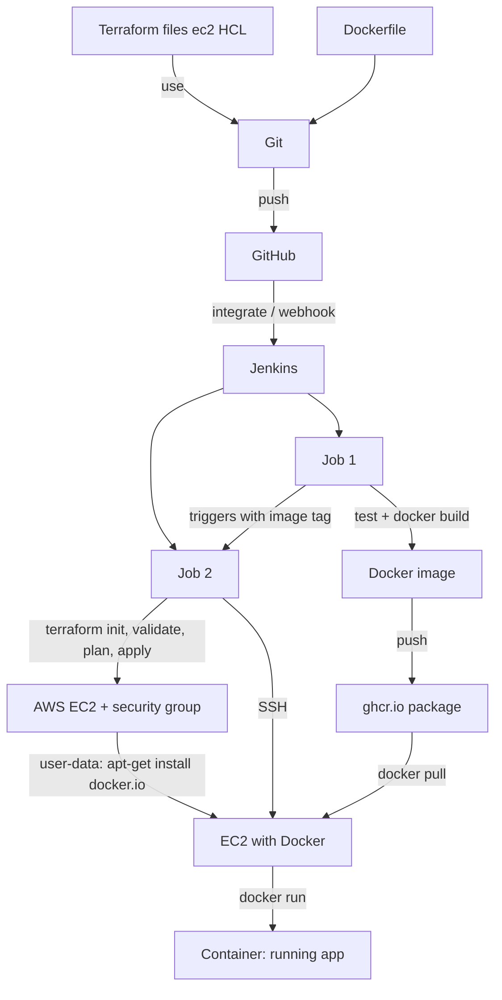

# Cloud + DevOps CI/CD Project (Jenkins + GHCR + Terraform + AWS EC2)

A small Flask To-Do API deployed with the instructor's workflow:
Terraform + Dockerfile -> Git -> GitHub -> Jenkins (Job 1, Job 2) -> GHCR -> AWS EC2 -> Docker container.

## Architecture


## Files
- `app/main.py` Flask app (`/health`, `/todos`). Data is in memory (resets on restart; no DB on purpose).
- `tests/` pytest tests. `Dockerfile` runs as non-root user.
- `Jenkinsfile.job1` test -> build -> tag -> push to GHCR -> triggers Job 2.
- `Jenkinsfile.job2` Terraform -> EC2 -> `scripts/deploy.sh` (SSH, docker pull, docker run, health check).
- `terraform/` EC2 + security group (default VPC). `scripts/deploy.sh` also does rollback.

## Local run
```
python3 -m venv .venv && . .venv/bin/activate
pip install -r app/requirements.txt
pytest -q
docker build -t todo:dev . && docker run -d -p 5000:5000 --name todo todo:dev
curl localhost:5000/health ; docker logs todo
```

## One-time setup (manual)
1. **GitHub**: create repo, push this code. Create a Personal Access Token (classic) with `write:packages` + `read:packages`.
2. **Jenkins** (needs Docker, Terraform, Python3, git, ssh on the Jenkins machine). Add credentials:
   - `ghcr-token` (Secret text) = the GitHub token
   - `aws-creds` (Username/password) = AWS access key id / secret
   - `ec2-ssh-key` (SSH private key) = private key of your AWS key pair
   - `tfvars-file` (Secret file) = your `terraform.tfvars` (see `terraform/terraform.tfvars.example`)
3. Create **two Pipeline jobs** from SCM pointing at this repo: `job1-build` (script path `Jenkinsfile.job1`) and `job2-deploy` (script path `Jenkinsfile.job2`).
4. Edit `YOUR_GITHUB_USERNAME` / `YOUR_REPO_NAME` in both Jenkinsfiles.
5. AWS: create an EC2 key pair in the console. Use `my_ip_cidr` = your IP/32.
6. **Webhook** (auto trigger): GitHub repo > Settings > Webhooks > `http://<jenkins-url>/github-webhook/`, and tick "GitHub hook trigger" in job1. Jenkins must be reachable from the internet (or use a tunnel such as ngrok).

## Deploy
Push to GitHub -> Job 1 builds `ghcr.io/<user>/<repo>:v<build>-<commit>` -> Job 2 creates EC2 and runs it.
Open `http://<ec2-ip>:5000/health`.

## Traceability
Git commit SHA -> image tag (`v12-ab12cd3`) -> GHCR image -> `/health` on EC2 shows the same version.

## Rollback
Run Job 2 with `IMAGE_TAG` = an older tag. See `docs/rollback.md`.

## Troubleshooting
- Push denied: token needs `write:packages`; repo name must be lowercase.
- EC2 pull fails: check `ghcr-token` has `read:packages`, or make the package public.
- SSH timeout: `my_ip_cidr` changed (home IP changes) -> update tfvars and re-run.
- `docker: permission denied` on Jenkins: add the jenkins user to the docker group.

## Cleanup (avoid AWS charges)
`cd terraform && terraform destroy -var-file=terraform.tfvars`. t2.micro is free-tier for new accounts; otherwise a small hourly charge. Public IPv4 addresses may also be billed. Terraform state is local (`terraform.tfstate`, git-ignored): keep Job 2's workspace so Jenkins remembers the instance.
